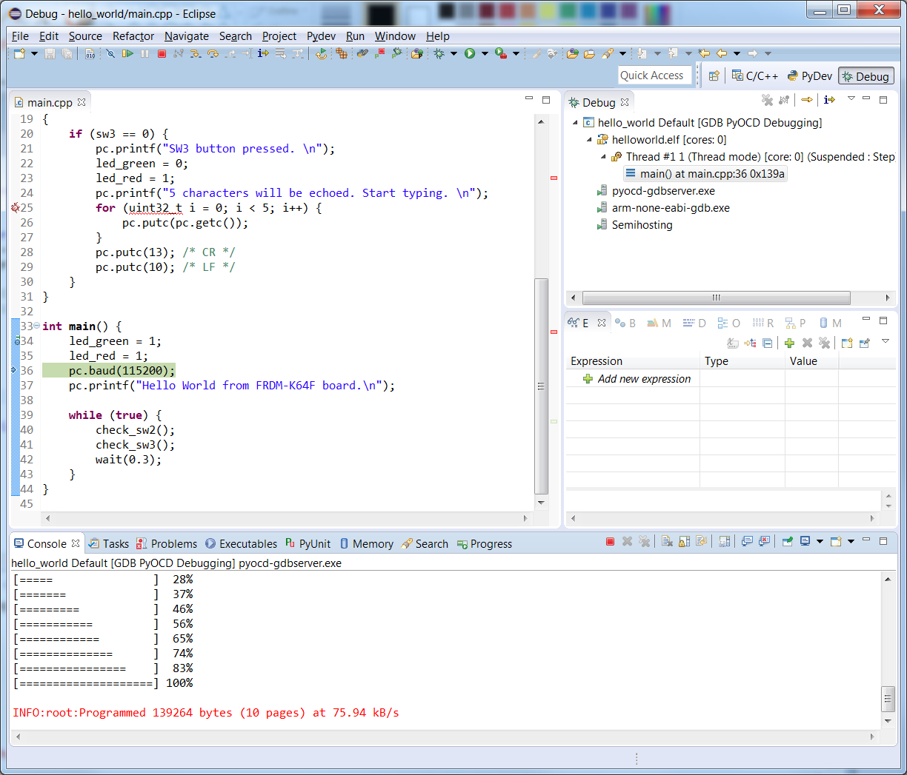
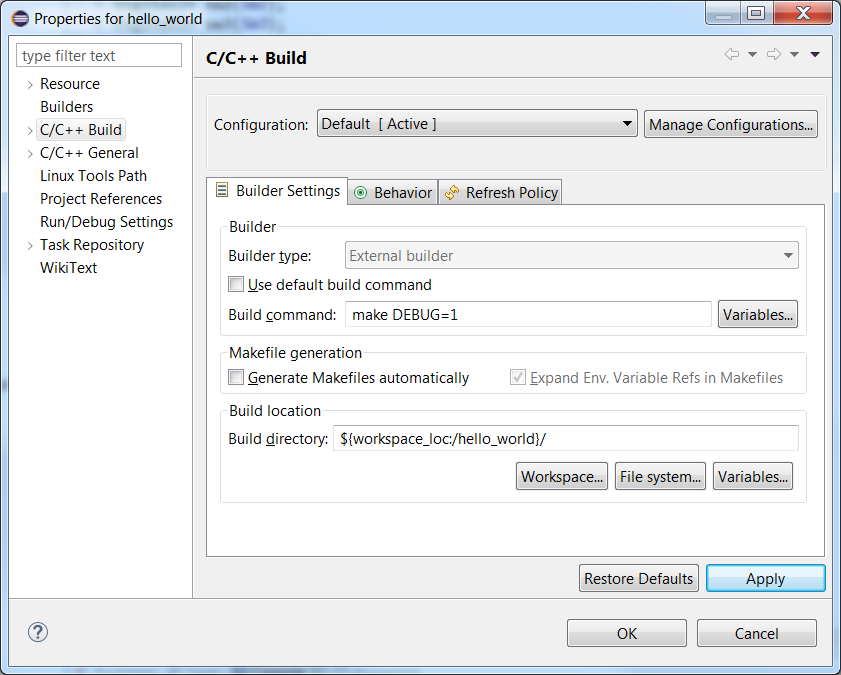
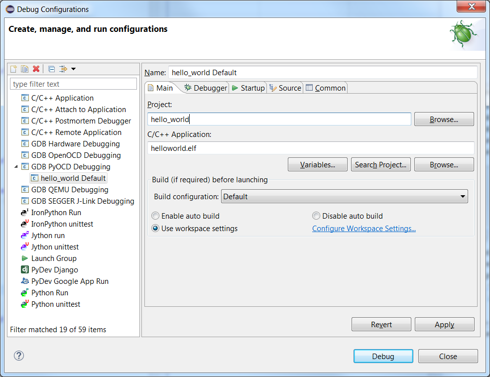
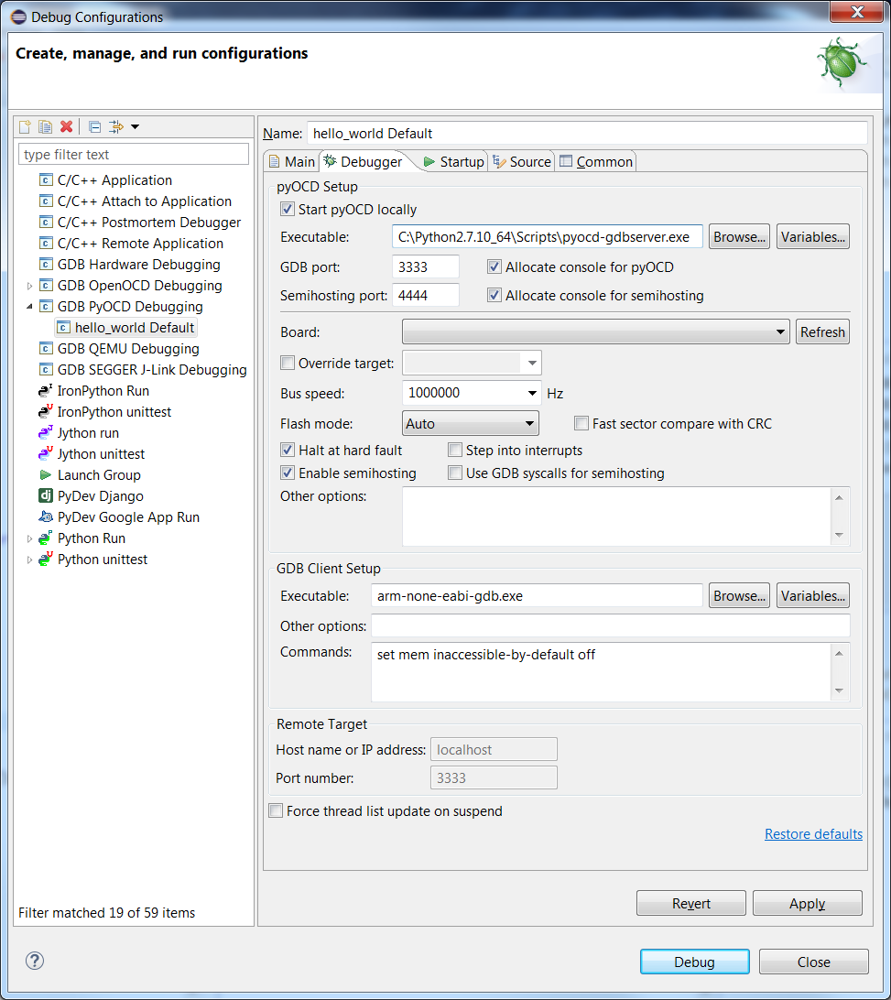

#Debugging with Eclipse and pyOCD

##Debugging
To start a debugging session, open the drop-down menu next to the bug icon and select the debug configuration created earlier. This will automatically load the current program and begin a debugging session. From there, you can do things such as set breakpoints, set watchpoints, view registers, view disassembly, browse memory and examine the callstack.

This article explains how to debug an exported mbed project with Eclipse and pyOCD. To debug a project, first, export it from mbed as a makefile project, then import the Makefile project into Eclipse and finally set up debugger configurations. You can find more detailed explanations of these steps below.

##Initial setup
1. Download the latest version of Eclipse with CDT.
1. Install the GNU ARM Eclipse plugin.
	1. Open Eclipse.
	1. Click the **Help** menu item and select **Install New Software**.
	1. In the **Work with** box paste the install address and press Enter: [http://redmine.laoslaser.org/boards/3/topics/635](http://sourceforge.net/projects/gnuarmeclipse/files/Eclipse/updates/).
  1. The package **GNU ARM C/C++ Cross Development Tools** appears. Select it.
  1. Click **Next** repeatedly and accept licence agreements.
  1. Click **Finish**. If prompted to restart Eclipse, click **Yes**.
1. [Install tools necessary for Makefile projects](https://docs.mbed.com/docs/mbed-os-handbook/en/5.3/dev_tools/third_party/):
  1. [GCC ARM Embedded](https://launchpad.net/gcc-arm-embedded).
  1. Windows only
    1. Add the GCC ARM Embedded's bin directory. For example, `C:\Program Files (x86)\GNU Tools ARM Embedded\4.9 2015q2\bin`.
    1. Install **Make** and add it to your system path. Make is available as one of the tools here: [http://gnuwin32.sourceforge.net/](http://gnuwin32.sourceforge.net/).
1. Python
  1. Windows Only: select "Add to path" when installing.
1. Install pyOCD by running ``pip install pyocd``.

##Importing to Eclipse and building
1. In the mbed Online Compiler, export the project you want to debug as **GCC (Arm Embedded)**. For more information, please see our [exporting guide](https://docs.mbed.com/docs/mbed-os-handbook/en/5.3/dev_tools/third_party/).
1. Unzip the project archive that mbed exports.
1. Open Eclipse.
1. **File** > **New** > **Makefile Project with Existing Code**.
  1. Paste the location of your project into **Existing Code Location**.
  1. **Project Name** automatically populates. You can update the name here.
  1. In **Toolchain for Indexer Settings**, select **Cross ARM GCC**.
  1. Click **Finish** to create the project.
1. To set up building in Eclipse, go to the **Project** menu item, and select **Properties**.
  1. Select **C/C++ Build**.
  1. Clear the **Use default build command** check box.
  1. For **Build command**, enter **make DEBUG=1**. The option "DEBUG=1" configures the Make file to build optimized code, which makes debugging easier.
  1. Click **Apply**. 
  1. Click **OK**.
  
1. Click the build button in Eclipse, and verify the project builds successfully.

##Setting up debug configuration
The last step before actually debugging is to set up the debug configuration. This only needs to be done once each project. Once created, the configuration can be checked into revision control, allowing anyone else working on the project to use it without needing to go through setup again.

1. To change configurations, **Run** > **Debug Configurations...**.
1. Right click on **GDB pyOCD Debugging** and select **New**.
1. Move to the **Main** tab. 
1. Verify **Project** is correct and **C/C++ Application** points to the .elf file.

1. Move to the **Debugger** tab.
  1. In the **pyOCD Setup** section:
    1. Check **Start pyOCD locally** if it isn't checked already.
    1. Set **Executable:** to **pyocd-gdbserver** or the full path to your installation.
    1. Set **GDB port:** to a free port. The default value of 3333 should work.
  1. In the **GDB Client Setup** section:
    1. Set **Executable** to **arm-none-eabi-gdb.exe**.
    1. In **Commands:**, add **set mem inaccessible-by-default off** if it is not present. It should look something like this when configured: 
  
  1. Move to the **Common** tab.
    1. To save the debug configuration locally and check it into the current project, select **Shared file** under **Save as**.
    1. In **Display in favorites menu box**, check **Debug**.
