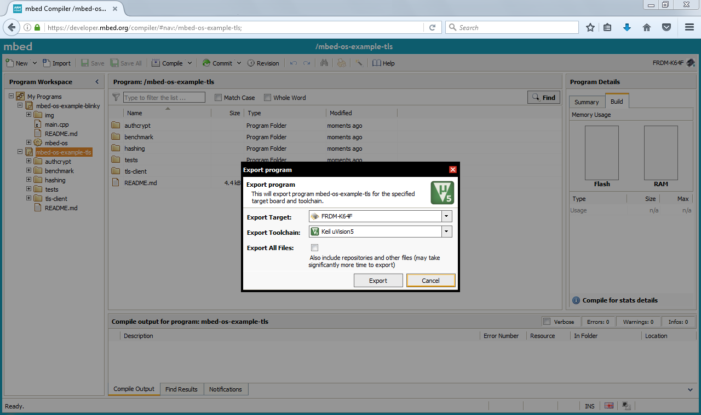
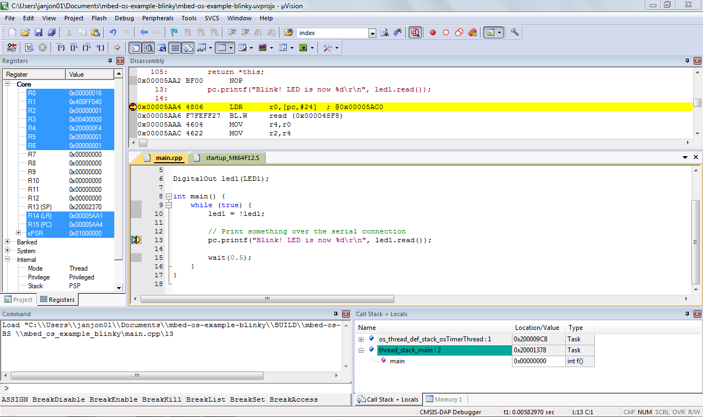
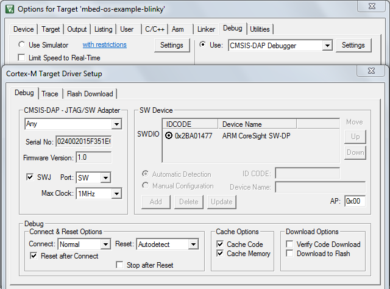

# Debugging mbed OS applications with Keil uVision

This document explains how to build and debug mbed OS applications using Keil uVision 5. Due to the linker limits, this does not work in the free version of uVision. If you do not have a uVision license, you can use [Eclipse](Debugging_Eclipse_pyOCD.md), [Visual Studio Code](vscode.md) or any other IDE that supports debugging through GDB. For more info, please see [Setting up a local debug toolchain](toolchain.md).

## Exporting a project

To export your project to uVision, you can use either the Online Compiler or mbed CLI.

<span class="notes">**Note:** Store the project on your local hard drive. uVision does not support building from a network share.</span>

### Online Compiler

1. Right click on your project.
1. Select *Export Program...*.
1. Under 'Export toolchain', select *Keil uVision 5*.
1. Click *Export*, and unpack at a convenient location.



### mbed CLI

1. In your project folder, run:

    ```
    # replace K64F with your target board
    $ mbed export -i uvision5 -m K64F --profile mbed-os/tools/profiles/debug.json
    ```

## Starting a debug session

The exported project contains a `.uvprojx` file. Double click on this file to open the project in uVision. uVision 5 does not support nested folders in the tree, so find your application source code by looking for a folder with the same name as your project.



To build your project and start a debug session:

1. Click *Project > Build Target*.
1. When building succeeds, click *Debug > Start/Stop Debug Session*.
1. If uVision does not connect to your development board, go to *Project > Options for Target > Debug*, and make sure 'CMSIS-DAP Debugger' is selected.



For more information on the CMSIS-DAP Debugger driver in uVision, see the [uVision documentation](http://www.keil.com/support/man/docs/dapdebug/dapdebug_drv_cfg.htm).
