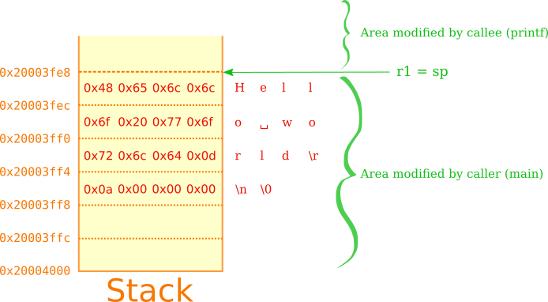

# Debugging the micro:bit with pyOCD and GDB

This tutorial shows how to debug a simple program on the micro:bit. Using only
GDB, we'll first try to understand what is happening on the chip and why the
program doesn't follow the expected behaviour. We will then attempt to modify its behaviour by writing directly into the chip's memory.

Note: The micro:bit's processor is based on the Nordic [nRF51][nRF51].

For reference, here are the tools I'm using. This is only a suggestion, as
pyOCD and GDB work just as well on Mac OS and Windows.

  * Linux (4.1), but pyOCD and GDB work on Windows and Mac OS.
  * pyOCD (0.4.5) can be obtained on [GitHub](https://github.com/mbedmicro/pyOCD).
  * arm-none-eabi-gdb (7.9.1) is usually present in package managers, or you can get it at [linaro](https://launchpad.net/gcc-arm-embedded)

### hello.hex

A simple program printing "hello world" to the serial console.

Note: Shell commands are prefixed with "$", GDB commands with "(gdb)"

#### Analysis

Let's start with a simple image for the micro:bit I received recently. It was
supposed to print something on the serial output, but nothing appeared. You can
find the hex file used in this tutorial at [hello.hex](http://jnz.fr/microbit/debugging/hello.hex).

The following command will start pyOCD with a soothing configuration:

    $ pyocd-gdbserver --persist -t nrf51 -bh -r
    INFO:root:Unsupported board found: 0224
    INFO:root:new board id detected: 022431864e45002d1013000000420000000033a24e45
    INFO:root:board allows 5 concurrent packets
    INFO:root:DAP SWD MODE initialised
    INFO:root:IDCODE: 0xBB11477
    INFO:root:4 hardware breakpoints, 0 literal comparators
    INFO:root:CPU core is Cortex-M0
    INFO:root:2 hardware watchpoints
    INFO:root:GDB server started at port:3333

Tip: if you don't have permission to access the board on Linux, you can use [this udev rule](https://developer.mbed.org/comments/perm/9920/).
The option -bh tells pyOCD to use hardware breakpoints, and -r tells it to halt the target after a reset.

By default, the server will listen for GDB commands on port 3333. It will
transfer those commands by USB to the interface chip. The interface chip, a
Freescale Kinetis KL26, will communicate those commands to the micro:bit's processor. 

GDB needs to connect to pyOCD with the following command:

    $ arm-none-eabi-gdb
    (gdb) target remote :3333
    0x0001a01c in ?? ()

Let's stop the processor and load our program:

    (gdb) load hello.hex
    (gdb) mon reset

This should display a progress bar in pyocd-gdbserver.

Tip: an example init script is provided at the end. By adding "-x /path/to/initscript" to the GDB command, you can connect to pyOCD and load a program automatically.

The following command will show the location of the program counter:

    (gdb) x/x $pc
    0x0:	0x000007c0

"x" is the command used to inspect memory, "/i" is the format, "$pc" is the
address. "help x" will give you more format options.

By hitting Enter, we can display the four following bytes:

    (gdb)
    0x4:	0x000006d1

This is the entry point address of the firmware. The first four bytes are its
stack location. You can step instructions with ''si''.

You can now start executing the image. Except for a hardfault, it should keep
rolling until you interrupt it, with Control+C.

    (gdb) c
    Continuing.
    
    ...
    
    ^C
    Program received signal SIGINT, Interrupt.
    0x0001f31e in ?? ()

This address already gives away a precious bit of information: we reached the
application code.

Indeed, assuming we're using the S110 SoftDevice, the application will be
located after address 0x18000. You can verify this using a tool like [srec_info](http://srecord.sourceforge.net/):

    $ srec_info hello.hex -intel
    Format: Intel Hexadecimal (MCS-86)
    Execution Start Address: 00018289
    Data:   000000 - 0007BF
            001000 - 016917
            018000 - 01C08F

Here, SoftDevice (the firmware packed inside hello.hex) ends at 0x16917.
The hello application is located between addresses 0x18000 and 0x1c08f.
Those values will be different when using the S130 SoftDevice, because the application
will start at 0x1c000.

By continuing the flow and stopping it a few times, we can see how the program
evolves:

    (gdb) c
    Continuing.
    ^C
    Program received signal SIGINT, Interrupt.
    0x0001f31e in ?? ()
    (gdb) c
    Continuing.
    ^C
    Program received signal SIGINT, Interrupt.
    0x0001f31e in ?? ()

It seems stuck at 0x1f31e. Let's see what instruction we're up against, using
the "i" formatter:

    (gdb) x /i $pc
    => 0x1f31e:	b.n	0x1f31e

We've reached a branch-to-self (possibly compiled from while(1)), so
it's not going any further.

It's either a deliberate infinite loop, or a panic. An idle loop would
have a wfi or wfe instruction in it, at least.

Let's have a look at the instruction stream leading to this loop. Most
instructions are encoded on two bytes, but some need four. We want to see about
four instructions before PC, which means the start address will be roughly $pc - 8:

    (gdb) x /4i $pc - 8
       0x1f316:	mov	r1, sp                      ; Put sp into r1
       0x1f318:	ldr	r0, [pc, #20] ; (0x1f330)   ; Load word at 0x1f330 into r0
       0x1f31a:	bl	0x1ec86                     ; Call 0x1ec86
    => 0x1f31e:	b.n	0x1f31e                     ; Branch to self

Understanding this requires a bit of knowledge about ARM assembly and calling
conventions. This code was generated from C by a compiler that follows the
[ARM assembly procedure call standard][AAPCS]. In this document, Table 2 in
section 5.1.1 defines how the compiler should use available registers when
calling a function.

Registers r0 to r3 are used to pass arguments to a function, which may return
something into r0. Using x, we can inspect the content of those arguments:

    (gdb) x/xw 0x1f330
    0x1f330:	0x20002880

r0 contains a pointer to address 0x20002880, which is the application RAM. This
is probably a Serial object, since we expect this call to be
"serial.printf(string)". We'll come back to this later. For the moment, let's
see what is put in r1 before the call. It is a pointer to the stack. The called
function (callee) is not supposed to modify the stack after the address ''$sp''
that it gets at the time of the call, so ''$sp'' is the same before and after the call:

    (gdb) x/4x $sp
    0x20003fe8:	0x6c6c6548	0x6f77206f	0x0d646c72	0x0000000a

This looks like ascii characters. We can confirm this with the /s formatter:

    (gdb) x/s $sp
    0x20003fe8:	"Hello world\r\n"

Warning: representation is little-endian, which means that the word 0x6c6c6548 represents the sequence [0x48, 0x65, 0x6c, 0x6c] in the memory.
Okay, main called printf with the right arguments. Let's look at the value
returned by printf:

    (gdb) print $r0
    $1 = 13

It returned 13, as in the number of letters successfully sent to the serial port :)

So it seems that the application did its job, but I still can't see anything
on the serial output!

I trust my serial console, but a hunch tells me that this issue is related to the Serial API configuration, most likely a wrong baudrate, because I can see
garbled data on the console when executing the program multiple times.

A quick test confirms that the program is using baudrate 9600 instead of
115200, which is the default for the micro:bit runtime.

The next section shows how you can modify what is printed, without rebuilding
anything. If you feel adventurous, the following section shows one method of
changing the baudrate to 115200 using only GDB.

#### Changing the printf string

You can now connect with a serial client at 9600 bauds, and check that the
program is indeed printing something.

Before calling printf, the stack looks like this:

The main function passes address 0x20003fe8 to printf in R1, which reads
it and sends each character to the serial port until it reaches a \0. Knowing
that, we can modify the printed string fairly easily:

First put a breakpoint just before the printf call:

    (gdb) b *0x1f31a
    (gdb) mon reset
    (gdb) c
    Continuing.
    
    Breakpoint 4, 0x0001f31a in ?? ()
    (gdb)

Then, change the string on the stack. Since the program ends right after this
call with an infinite loop (and there is no other thread), you don't even have
to worry about the following bytes on the stack. You only need to make sure that
your string ends with a zero byte, and doesn't go over 0x20003fff. This means a
maximum of 23 characters (plus the final \0).

    (gdb) set (char [24])*0x20003fe8 = "Hello microbit!\r\n"
    (gdb) c
    Continuing.

And you should see the new string appear on your console :)

#### Investigating the actual bug

After analysing mbed's [serial API](https://developer.mbed.org/users/mbed_official/code/mbed/docs/bad568076d81//classmbed_1_1Serial.html),
we can see that the Serial class inherits from SerialBase. From the assembly
point of view, calling serial_instance.printf(string) is, in essence, like calling
Serial::printf(serial_instance, string). And we saw previously that the
instance's address is r0 = 0x20002880.

Because of the way the C++ compiler handles inheritance, the Serial class data will look like this in the memory:

    SerialBase {
        ...
        FunctionPointer _irq[2];        // 0x20002874
        int             _baudrate;      // 0x2000287c

        Serial {                        // 0x20002880
            void *      vtable;
            ...
        }
    }

And indeed, when we inspect this hypothetical _baudrate variable, it all makes
sense:

    (gdb) x /d 0x20002880 - 4
    0x2000287c: 9600

The serial port on the device is configured to run at 9600 bits per second,
whereas I attempted to read it at 115200 (which is the default for the micro:bit
runtime).

Just for fun, and to confirm this is the only issue, let's try to modify the
value written to the device's BAUDRATE register. It is located at address 0x40002524, as described in section 29.10 of the [nRF51 reference][nRF51].

We add a watchpoint on its memory-mapped location, and restart the application:

    (gdb) watch *0x40002524
    Hardware watchpoint 1: *0x40002524
    (gdb) mon reset
    (gdb) c
    Continuing.
    
    Program received signal SIGTRAP, Trace/breakpoint trap.
    0x0001f520 in ?? ()
    (gdb) c
    Continuing.
    
    Program received signal SIGTRAP, Trace/breakpoint trap.
    0x0001f520 in ?? ()
    (gdb) print/x $lr
    $2 = 0x1ebf1
    (gdb) c
    Continuing.
    ...

This tells us that the register is written from two different locations.
The program is interrupted right after the instruction that changes BAUDRATE, so
the actual write is located at address 0x1f51e:

    (gdb) mon reset
    (gdb) c
    (gdb) x/i 0x1f51e
    0x1f51e:    str r0, [r1, #36]   ; 0x24
    (gdb) print/x $r1 + 36
    $3 = 0x40002524
    (gdb) print/x $r0
    $4 = 0x275000
    (gdb) print/x $lr
    $5 = 0x1f091

In the same section of the nRF51 reference, we can see the values associated with each baudrate:
0x275000 corresponds to 9600, and 0x01D7E000 corresponds to 115200.

For the second break, LR is 0x1ebf1, which is different from the first call.
This means that two different function calls set the baudrate.
We don't really care about the actual code and functions here. The info we already got is enough to do what we want, in the form of a breakpoint command:

    (gdb) del break 1                       ; Remove our previous watchpoint
    (gdb) break *0x1f51e if $lr == 0x1ebf1
    Breakpoint 2 at 0x1f51e

This line tells pyOCD to set a breakpoint at address 0x1f51e, and stop only
when LR is 0x1ebf1, which is the last call to serial_baud. Then, we attach a
command to this breakpoint, to modify the value put into BAUDRATE:

    (gdb) commands 2
    Type commands for breakpoint(s) 2, one per line.
    End with a line saying just "end".
    >set $r0 = 0x01d7e000
    >continue
    >end

Then execute our little patch:

    (gdb) mon reset
    (gdb) c
    ...
    Breakpoint 3, 0x0001f51e in ?? ()
    ...

And you should see "Hello world" written at 115200 bauds on your console :)

### Cheat sheet

#### Commands

This section describes some useful commands. 

    <enter> repeats the previous command

    b *0x18310, break           breakpoint on this address
    w *0x20003ffc, watch        watchpoint

    c, continue
    mon halt                    tell pyOCD to stop the target
    mon reset                   tell pyOCD to restart the target
    si, stepi                   step instruction
    
    info b                      breakpoint informations
    del 2                       delete breakpoint 2
    
    info reg                    show registers
    
    set *0x20002560 = (char)42  change a byte of memory
    set $pc = $pc + 2           change PC
    set $pc = *0x18004          go to application entry point (with s110)
    
    find 0x20000000, +0x4000, (char [14])"Hello world\r\n"
                                Locate a 0-terminated string in RAM
    find 0x0, +0x40000, 0x2580  Locate a word in flash
    
    # By default, only flash and RAM are accessible. The following allows to
    # fiddle with memory mapped IO:
    mem 0x40000000 0x40001000   add the clock memory location.
    info mem
    
    # To show the value of LFCLKSRC:
    x/x 0x40000518              (0: RC clock, 1: external)
    
    # To change it:
    set *0x40000518 = 0
    
    In the same vein, inspect ARM system registers:
    mem 0xe000e000 0xe000f000
    x/x 0xe000ed28              show CFSR

#### Example GDB init script

Pure GDB scripts are a bit limited and cumbersome to write. If you want to
automate stuff, you can directly script pyOCD or GDB using Python.

With that in mind, here is what I use to initialise my GDB, with the "-x" switch:

    set history save on
    set history size unlimited
    
    target remote :3333
    
    disp /i $pc
    
    # ARMv7-M peripherals
    mem 0x40000000 0x5fffffff
    
    # ARMv7-M system registers
    mem 0xe0000000 0xffffffff
    
    define run_program
        load $arg0
        mon reset
        c
    end
    
    define show_context
        # function used by pc, below
        set $before = $arg0
    
        # haem... Roughly two bytes per instruction.
        if $before > (int)$pc * 2
            set $before = (int)$pc / 2
        end
        x /20i $pc - $before
    end
    
    define pc
        if $argc < 1
            show_context 20
        else
            show_context $arg0
        end
    end
    
    document run_program
        Load a program and restart the target
        Usage: run_program /path/to/image
    end
    
    document pc
        Show 20 instructions surrounding the PC.
        Usage: pc [BYTES_PRECEEDING]
    end

---
Happy hacking!

[nRF51]: https://www.nordicsemi.com/eng/Products/nRF51-Series-SoC "nRF51 reference manual"
[AAPCS]: http://infocenter.arm.com/help/topic/com.arm.doc.ihi0042e/IHI0042E_aapcs.pdf "ARM architecture procedure call standard"
