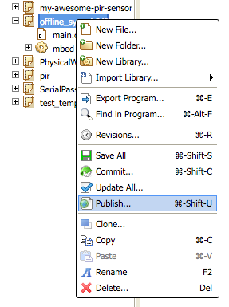
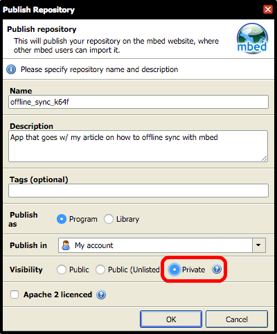
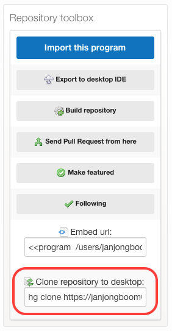
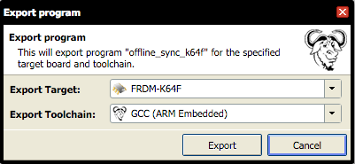
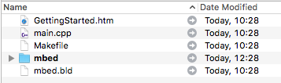
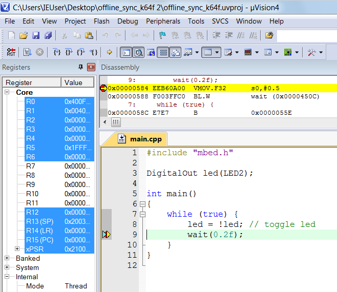
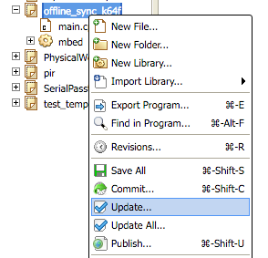
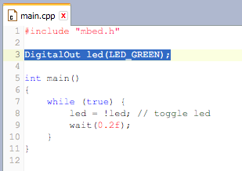
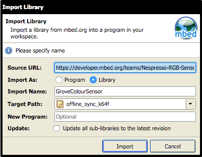
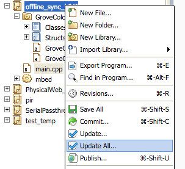

# Offline development and debugging with mbed

At the heart of mbed we have an online compiler. While that is incredibly convenient for getting a project started or while prototyping, chances are that at some point you'll miss a debugger, or you'll want to develop while not having an active internet connection. Fortunately, we support exporting applications to a number of toolchains - including GCC, uVision and Eclipse - and committing source code back to the online environment. Combining the best of both the online and offline world.

In this article we'll:

* Cover ways to set up your local toolchain.
* Show how to debug applications with your favourite IDE.
* Explain how to sync online and offline code and libraries.

## Requirements 

To follow along you'll need to have the following software installed on your local machine:

* A build toolchain: either GCC and Make - which we explore here -  or [uVision](https://docs.mbed.com/docs/debugging-on-mbed/en/latest/Debugging/Keil/), [Eclipse](https://developer.mbed.org/cookbook/eclipse-for-building-and-debugging) or [Visual Studio](http://visualgdb.com/tutorials/arm/mbed/).
* [Mercurial](https://www.mercurial-scm.org/wiki/Download) (hg).

<span style="background-color:#E6E6E6;border:1px solid #000;display:block; height:100%; padding:10px">**Note:** On Windows you might want to install [Cygwin](https://www.cygwin.com) for GCC and make.</span>

## Writing a simple application

Let's start by writing a simple application in the [online compiler](https://developer.mbed.org/compiler/).

1. Create an empty project.
1. Select your target (in this example we're using FRDM-K64F, but any target will work).
1. Add the `mbed` library.
1. Create a `main.cpp` file with the following content:

```cpp
#include "mbed.h"

// if you're not using FRDM-K64F, change this line
DigitalOut led(LED_RED);

int main()
{
    while (true) {
        led = !led; // toggle led
        wait(0.2f);
    }
}
```

Click  *Compile* and verify that your application builds as expected.

## Build the application with a local toolchain

Before we can take our application offline, we first want to publish our project. This is required because it creates a Mercurial (hg) repository backing the project. We can use this repository to sync between the online compiler and our local toolchain.

### Step 1: Publishing

In the online IDE, right click on your project name and select *Publish*:

<span style="text-align:center; display:block;"></span>

You can choose to publish this project privately to prevent others from seeing it. Your repository is always write-protected, regardless of the setting you choose:

<span style="text-align:center; display:block;"></span>

After publication you get a link to your project page, which has a *Clone repository to desktop* button. While this will indeed clone your repository, we would be  missing build files for your toolchain, so we don't want to click this just yet:

<span style="text-align:center; display:block;"></span>

### Step 2: Exporting

To get the build files we need, we use the online IDE to export a project to our toolchain. This will not just give us the source code, it will also set up a Makefile or a project file (depending on the toolchain).

For simplicity we'll be using GCC. Go back to the online compiler, right click on the project and select *Export*:

<span style="text-align:center; display:block;"></span>

This generates a ZIP file that contains our source code, a Makefile and all the libraries we depend on (just one for now: `mbed`):

<span style="text-align:center; display:block;"></span>

Open a terminal window and navigate to the folder to which you extracted the project. You can verify whether we can build locally by running:

```bash
$ make
```

You'll now have a *.bin or *.hex file (depending on your target) that you can flash to your board using drag and drop.

## Debugging the application

We can now debug our application using [GDB](https://docs.mbed.com/docs/debugging-on-mbed/en/latest/Debugging/pyOCD/), but we can also use a visual debugger by exporting to a target that supports this, for example  [uVision](https://docs.mbed.com/docs/debugging-on-mbed/en/latest/Debugging/Keil/), [Visual Studio](http://visualgdb.com/tutorials/arm/mbed/) or [Eclipse](https://developer.mbed.org/cookbook/eclipse-for-building-and-debugging).

For instance, here I used the same approach to export to uVision 4 and start a debug session:

<span style="text-align:center; display:block;"></span>

*Debugging with uVision 4 on the left, and syncing changes back to the online compiler on the right*

## Syncing changes back to the online compiler

You can now edit the code locally. For instance, you can change how fast the LED blinks, or change the color of the LED. If you use the FRDM-K64F target, you could remove line 3 in `main.cpp` and replace it with:

```cpp
DigitalOut led(LED_GREEN);
```

Rebuild (call `make`) and flash the application to verify that your code compiles and works.

Now you can commit your changes back. Your code is automatically backed by the Mercurial repository that we created earlier, so before you can commit your changes you first need to configure Mercurial with your name and e-mail address:

```bash
$ hg config --edit
```

You can now run `hg status` to see which files we have changed:

```bash
$ hg status
    M main.cpp
    ? main.d
    ? main.o
    ? offline_sync_k64f.bin
    ? offline_sync_k64f.elf
    ? offline_sync_k64f.hex
    ? offline_sync_k64f.map
```

You can commit `main.cpp` back to mbed using:

```bash
$ hg commit -m "Change color from red to green"
$ hg push
```

Fill in your ARM mbed username and password when prompted.

You'll see something like this:

```bash
$ hg push
    pushing to https://developer.mbed.org/users/janjongboom/code/offline_sync_k64f/
    http authorization required for     https://developer.mbed.org/users/janjongboom/code/offline_sync_k64f/
    realm: mbed.org
    user: janjongboom
    password:
    searching for changes
    remote: adding changesets
    remote: adding manifests
    remote: adding file changes
    remote: added 1 changesets with 1 changes to 1 files
```

<span style="background-color:#E6E6E6;border:1px solid #000;display:block; height:100%; padding:10px">**Tip:** You can store your credentials, so you don't have to type them again all the time. [Here are instructions](http://stackoverflow.com/questions/2584407/how-to-save-username-and-password-with-mercurial).</span>

Now go back to the online compiler, right click on your project and select *Update* to pull in the changes you made locally:

<span style="text-align:center; display:block;"></span>

When you open `main.cpp` in the online compiler you'll see that our changes have made it back online:

<span style="text-align:center; display:block;"></span>

### Retrieving changes made in the online compiler

If you change something in the online compiler, click *Commit* > *Publish* to push back to the repository.

To get the latest changes, locally run:

```bash
$ hg pull
$ hg update
```

## Libraries

One of the nice features of mbed is the vast set of libraries already available online, which can quickly be added through the online compiler. However, library management works a bit differently offline. In the online compiler libraries are represented as a single file per library, which contains both the repository where the library is located and the commit hash (version) of the library. This file is then used to find the exact version of the library when compiling. Offline we cannot use this system, as we need an offline copy of the actual source code before we can build.

Let's add a library in the online compiler:

1. Right click on your application.
1. Select *Import Library > From URL*
1. Enter the URL https://developer.mbed.org/teams/Nespresso-RGB-Sensor/code/GroveColourSensor/.

    <span style="text-align:center; display:block;"></span>

1. In `main.cpp`, add a line to reference the library:

    ``#include "GroveColourSensor/GroveColourSensor.h"``

1. Commit the change and publish the repository.

If we now look in our repository we have a file called [GroveColourSensor.lib](https://developer.mbed.org/users/janjongboom/code/offline_sync_k64f/file/44238a870814/GroveColourSensor.lib) with the following content:

```
https://developer.mbed.org/teams/Nespresso-RGB-Sensor/code/GroveColourSensor/#f6a136b99533
```

This specifies both the Mercurial repository to which this library points and the commit hash we're using (`f6a136b99533`).

### A note about cloning exported applications

In this example, we added a library and then took our application offline. But as you continue to work, you might go online and add a library to an application *after* taking it offline. In that case, the offline application will not automatically receive the library you added to the online copy:

```
$ hg pull
    pulling from https://developer.mbed.org/users/janjongboom/code/offline_sync_k64f/
    searching for changes
    adding changesets
    adding manifests
    adding file changes
    added 1 changesets with 1 changes to 1 files
    (run 'hg update' to get a working copy)
$ hg update
    1 files updated, 0 files merged, 0 files removed, 0 files unresolved
$ make
    # snip
    main.cpp:2:51: fatal error: GroveColourSensor/GroveColourSensor.h: No such file or directory
     #include "GroveColourSensor/GroveColourSensor.h"
                                                       ^
    compilation terminated.
    make: *** [main.o] Error 1
```

__Manually cloning a library__

So let's take a look at the lib file, and add the repository ourselves:

```bash
# read the path
$ cat GroveColourSensor.lib
    https://developer.mbed.org/teams/Nespresso-RGB-Sensor/code/GroveColourSensor/#f6a136b99533
# clone that path
$ hg clone https://developer.mbed.org/teams/Nespresso-RGB-Sensor/code/GroveColourSensor/#f6a136b99533
    destination directory: GroveColourSensor
    adding changesets
    adding manifests
    adding file changes
    added 6 changesets with 9 changes to 3 files
    updating to branch default
    2 files updated, 0 files merged, 0 files removed, 0 files unresolved
offline_sync_k64f $ make
    # snip
    arm-none-eabi-size  offline_sync_k64f.elf
       text	   data	    bss	    dec	    hex	filename
      28696	    176	    320	  29192	   7208	offline_sync_k64f.elf
```

Now the application builds locally again, using the library we just added in the online compiler.

### Keeping online and offline libraries synced

### Syncing offline libraries

Whenever someone updates a library in the online compiler, we need to update the offline library to match.

To update, first find out the commit hash (the part after '#') in the .lib file:

```bash
$ cat GroveColourSensor.lib
    http://mbed.org/teams/components/code/GroveColourSensor/#56d6b711b8c7
```

Here, `56d6b711b8c7` is the commit hash. Checkout this commit in the library folder:

```bash
$ cd GroveColourSensor
$ hg checkout 56d6b711b8c7
    0 files updated, 0 files merged, 0 files removed, 0 files unresolved
```

#### Syncing online libraries

If you update libraries offline, you'll need to manually update the online .lib file.

Let's say that the last commit of GroveColourSensor has some problems and we want to revert to the previous commit:

```bash
$ cd GroveColourSensor
# checkout a different commit
$ hg checkout f0e8304db2a3
    1 files updated, 0 files merged, 0 files removed, 0 files unresolved
# get the current commit hash
$ hg id -i
    f0e8304db2a3
```

Copy the hash (it was returned above by `hg id -i`) and paste it back into GroveColourSensor.lib (after the `#`). Now commit and push:

```bash
$ hg status
    M GroveColourSensor.lib
$ hg commit -m "Update GroveColourSensor to previous commit"
$ hg push
    pushing to https://developer.mbed.org/users/janjongboom/code/offline_sync_k64f/
    searching for changes
    remote: adding changesets
    remote: adding manifests
    remote: adding file changes
    remote: added 1 changesets with 1 changes to 1 files
```

To update the library in the online compiler, we right click on the project and select 'Update all...'.

<span style="text-align:center; display:block;"></span>

The library is now updated, and we can continue working in the online compiler.

## Conclusion

Using mbed does not mean always using the online compiler. It's an easy way to get started, but when you need to - you can quickly export your code to your local toolchain. Exporting does not mean that you lose access to the online compiler or the library system, because it's easy to commit your code back upstream whenever needed.

Happy coding!

---

*[Jan Jongboom](http://twitter.com/janjongboom) is Developer Evangelist IoT at ARM, and loves step-debugging.*


