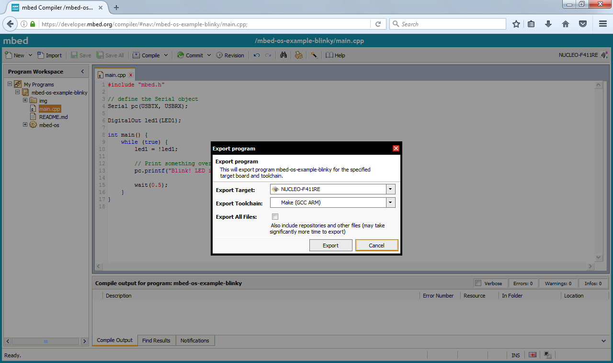

# Debugging mbed OS 5 applications with other IDEs

There are extensive instructions on debugging mbed OS 5 applications with [uVision 5](Keil.md), [Eclipse](Debugging_Eclipse_pyOCD.md) and [Visual Studio Code](vscode.md), but you can use any IDE that supports GDB to debug mbed OS 5 applications. This document will give some pointers on how to configure these IDEs. Before starting, first [configure your local debug toolchain](toolchain.md).

## Exporting your project

To build your project locally you first need a Makefile, which can be use by virtually any C/C++ IDE to build your project. To generate this Makefile, you can use either the Online Compiler or mbed CLI.

### Online Compiler

1. Right click on your project.
1. Select *Export Program...*.
1. Under 'Export toolchain', select *Make (GCC ARM)*.
    * For most targets you can also export to IAR or ARMCC.
1. Click *Export*, and unpack at a convenient location.



### mbed CLI

In your project folder, run:

```
# alternatively, use -i make_armc5 for ARMCC, or -i make_iar for IAR
# replace K64F with your target board

$ mbed export -i make_gcc_arm -m K64F --profile mbed-os/tools/profiles/debug.json
```

## Building your project

You can now configure your IDE to build this project, by setting the build command to:

```
make -j
```

The resulting binary will end up at `BUILD\projectname.elf`.

## Debugging your project

To debug your project you first need to start a [debug server](toolchain.md#Running-a-debug-server). This is often exposed as a setting in your IDE under 'Remote debugging' or 'Debug server'.

Set the path and the arguments to:

* When using pyOCD - the full path to the `pyocd-gdbserver` binary, with no arguments set.
* When using OpenOCD - the full path to the `openocd` binary, with the arguments set for your development board (see [the instructions](toolchain.md#OpenOCD)).

Next, you'll need to configure GDB.

* Set the program to be debugged to the location of the `.elf` file.
* Set the remote target to `localhost:3333`.
* Set the following options as 'set up commands' (to be executed right after connecting to GDB):

    ```
    -target-select remote localhost:3333
    -file-exec-and-symbols YOUR_PROJECT_ROOT\BUILD\projectname.elf"
    -interpreter-exec console "monitor reset"
    -interpreter-exec console "monitor halt"
    -interpreter-exec console "monitor arm semihosting enable"
    -target-download
    ```

    Make sure to update the path on line 2 to your `.elf` file.

This should start up a debug server, attach GDB to your development board, flash the binary using GDB, and start a debug session.
