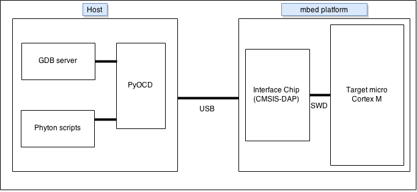

#Debugging with pyOCD

This article uses BLE as an example, but the techniques presented here are not BLE-specific.

##pyOCD-Based Debugging (GDB Server)

<span class="notes">**Note:** using GDB (or any other debugger) to connect to the GDB server is useful only if we have access to the program symbols and their addresses. This is currently *not* exported when building ``.hex`` files using the mbed online IDE. We therefore need to export our project to an offline toolchain to be able to generate either an ``.elf`` file that holds symbols alongside the program, or a ``.map`` file for symbols. In the following section, we're assuming an ``.elf`` file.
</span>

The interface chip and the target microcontroller are connected over a serial wire debug (SWD). This protocol offers debugging capabilities for stack trace analysis, register dumps and inspection of program execution (breakpoints, watchpoints etc). When combined with a source-level debugger on the development host, such as the GNU Project Debugger (GDB), SWD offers a very rich debugging experience - much more powerful than ``printf()``. 

<span class="tips">**Tip:** GDB is often "too rich" - don't forget the fast efficiency of ``printf()`` and the LEDs.
</span>

The interface chip implements CMSIS-DAP. To drive the CMSIS-DAP interface chip over USB, you'll need to install the [pyOCD Python library](https://github.com/mbedmicro/pyOCD) on the development host.

<span class="images">

</span>

To install pyOCD, follow the [instructions](https://github.com/mbedmicro/pyOCD/blob/master/README.md#installation) to get the external USB libraries pyOCD relies on.

<span class="notes">**Notes:** 
<br />a. You'll need to run ``setup.py`` for both the USB libraries and pyOCD.
<br />b. You can follow [HOW_TO_BUILD.md](https://github.com/mbedmicro/pyOCD/blob/master/HOW_TO_BUILD.md) to see how to build pyOCD into a single executable GDB server program.
<br />c. A series of tests in the [test sub-folder](https://github.com/mbedmicro/pyOCD/tree/master/test) offers scripts that you may find useful as a foundation for developing custom interaction with the targets over CMSIS-DAP.</span>

The GDB server can be launched by running ``gdb_server.py``. This script should be able to detect any connected mbed boards. Here is an example of executing the script from the terminal while a Nordic mKIT is connected:

```
$ sudo python test/gdb_server.py
Welcome to the PyOCD GDB Server Beta Version
INFO:root:new board id detected: 107002001FE6E019E2190F91
id => usbinfo | boardname
0 =>   (0xd28, 0x204) [nrf51822]
INFO:root:DAP SWD MODE initialised
INFO:root:IDCODE: 0xBB11477
INFO:root:4 hardware breakpoints, 0 literal comparators
INFO:root:CPU core is Cortex-M0
INFO:root:2 hardware watchpoints
INFO:root:GDB server started at port:3333
```

At this point, the target microcontroller is waiting for interaction from a GDB server. This server is running at port 3333 on the development host. You can connect to it from a debugger such as GDB (the client).

Here is an example of launching the GDB client:

```
~/play/demo-apps/BLE_Beacon/Build$ arm-none-eabi-gdb BLE_BEACON.elf
GNU gdb (GNU Tools for ARM Embedded Processors) 7.6.0.20140731-cvs
Copyright (C) 2013 Free Software Foundation, Inc.
License GPLv3+: GNU GPL version 3 or later <http://gnu.org/licenses/gpl.html>
This is free software: you are free to change and redistribute it.
There is NO WARRANTY, to the extent permitted by law.  Type "show copying"
and "show warranty" for details.
This GDB was configured as "--host=x86_64-unknown-linux-gnu 
	--target=arm-none-eabi".
For bug reporting instructions, please see:
<http://www.gnu.org/software/gdb/bugs/>...
Reading symbols from 
	/home/rgrover/play/demo-apps/BLE_Beacon/Build/BLE_BEACON.elf...
warning: Loadable section "RW_IRAM1" outside of ELF segments
(gdb)
```

Notice that we pass the .``elf`` file as an argument. We could also have used the ``file`` command within GDB to load symbols from this ``.elf`` file after starting GDB. The command set offered by GDB to help with symbol management and debugging is outside the scope of this document, but you can find it in [GDB's documentation](https://www.gnu.org/software/gdb/documentation/).

Now, we connect to the GDB server (for ease of reading, we've added line breaks in the path);

```
(gdb) target remote localhost:3333
Remote debugging using localhost:3333
warning: Loadable section "RW_IRAM1" outside of ELF segments
HardFault_Handler () at 	/home/rgrover/play/mbed-src/libraries
		/mbed/targets/cmsis/TARGET_NORDIC/TARGET_MCU_NRF51822
		/TOOLCHAIN_ARM_STD/TARGET_MCU_NORDIC_16K
		//startup_nRF51822.s:115
11	B 	.
(gdb)
```

Now we can perform normal debugging using the GDB command console (or a GUI, if our heart desires).

## Further Reading

There is another example of debugging with pyOCD [here](http://redmine.laoslaser.org/boards/3/topics/635).

______
Copyright © 2015 ARM Ltd. All rights reserved.
